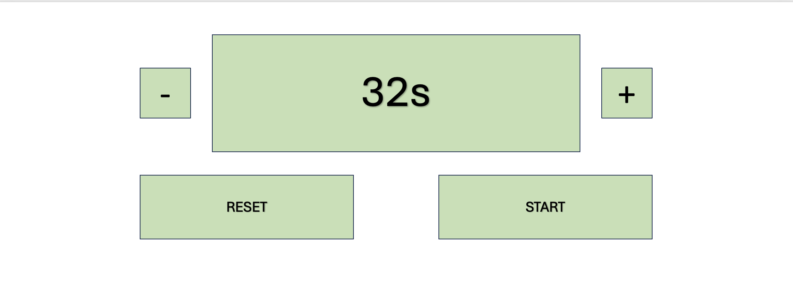
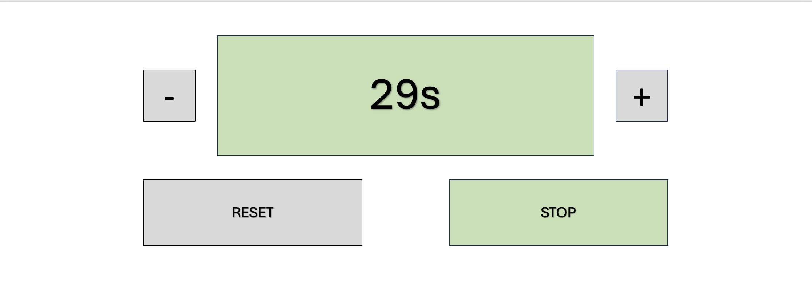

# Exercise 3 - Timer

Implement a timer that can count down from a user-set time to 0s.

The timer shall have a '+' and a '-' button, which adds/substracts one second from the time.

The timer shall have a 'reset' button, which sets the timer back to 0s.

The timer shall have a 'start' button, which starts the count down. When the button is clicked, it changes into a 'stop' button, which then stops the countdown.

The user can not use the '+', '-', or 'reset' button when the timer is started. These buttons can be used again when the timer is stopped, or the time reaches 0s.

You can find some very basic design suggestions in the files [stopped.png](./stopped.png) and [started.png](./started.png). However, you are free to style the application however you want.

You may edit [timer.html](./timer.html), [timer.js](./timer.js), and [timer.css](./timer.css).
